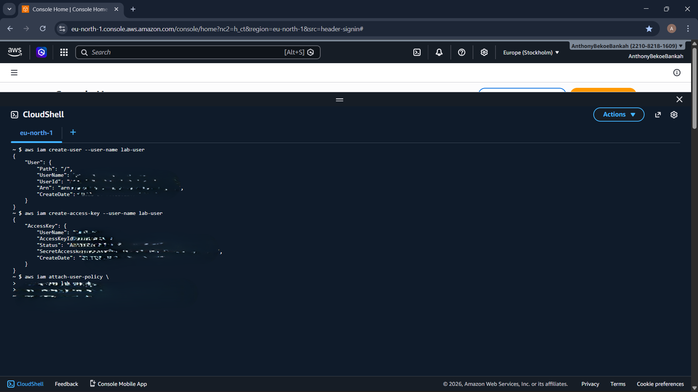
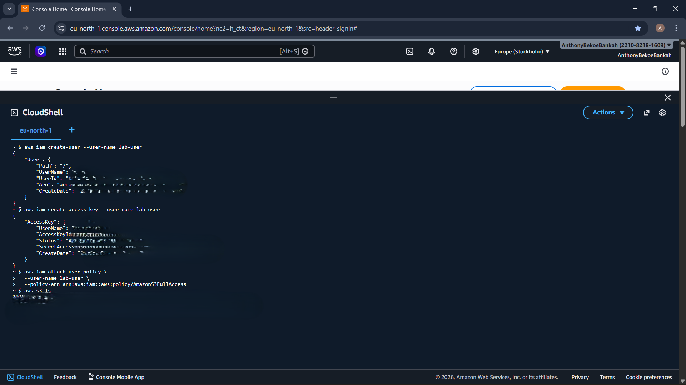

# Lab Report: Testing IAM User Permissions

## Student Name
*Anthony Bekoe Bankah*

## Date
*08/04/2026*

## Lab Title
**Task 1: Create IAM User + S3 Access (CloudShell)**

---

## Objective
The objective of this lab is to:
- Create an IAM user
- Generate access credentials
- Assign permissions using an AWS managed policy
- Verify access to AWS S3 services

---

## Tools & Environment
- AWS Management Console  
- AWS CloudShell / AWS CLI  
- IAM Service  
- Amazon S3  

---

## Procedure

### Step 1: Create a New IAM User
A new IAM user named `lab-user` is created to establish a new identity within the AWS account.

#### CLI Command
```bash
aws iam create-user --user-name lab-user
```

#### Output
```bash
{
    "User": {
        "Path": "/",
        "UserName": "lab-user",
        "UserId": "XXXXXXXXXXXXXXXXXXXXXXX",
        "Arn": "arn:aws:iam::221082181609:user/lab-user",
        "CreateDate": "2026-04-08T08:11:38+00:00"
    }
}
```

#### Why
We don’t use root user
We create least-privileged users

---

### Step 2: Generate Security Credentials
Access keys are generated for the user to enable programmatic access.

- **AccessKeyId** → Acts as a username  
- **SecretAccessKey** → Acts as a password (displayed only once)

#### CLI Command
```bash
aws iam create-access-key --user-name lab-user
```

#### Output
```bash
{
    "AccessKey": {
        "UserName": "lab-user",
        "AccessKeyId": "XXXXXXXXXXXXXXXXXXXX",
        "Status": "Active",
        "SecretAccessKey": "XXXXXXXXXXXXXXXXXXXXXXXXXXXXXXXXXXXXXXXX",
        "CreateDate": "2026-04-08T08:12:47+00:00"
    }
}
```

#### Why
Needed for programmatic access (CLI, SDKs)

---

### Step 3: Attach Permissions to the User
An AWS managed policy is attached to grant full access to Amazon S3.

- **Policy Name:** `AmazonS3FullAccess`  
- **Policy ARN:** `arn:aws:iam::aws:policy/AmazonS3FullAccess`
- `arn`: Standard prefix for Amazon Resource Name.
- `aws`: Specifies the partition the resource is in (standard AWS regions).
- `iam`: Identifies the AWS Service (Identity and Access Management).
- `:`: (Empty field) In this specific ARN, the Account ID is left blank because this is an AWS Managed Policy created by Amazon, rather than one you created in your own account.
- `policy/`: Specifies the resource type (a policy).
- `AmazonS3FullAccess`: The friendly name of the policy.

#### CLI Command
```bash
aws iam attach-user-policy \
  --user-name lab-user \
  --policy-arn arn:aws:iam::aws:policy/AmazonS3FullAccess
```

#### Output
```bash
  No output
```

#### Why
AWS prefers: Managed policies (easy, reusable)
Instead of: Inline policies (harder to manage)

---

### Step 4: Verify Permissions
The following command verifies that the user has the correct permissions by listing all S3 buckets.

#### CLI Command
```bash
aws s3 ls
```

#### Output
```bash
  2026-04-07 16:10:38 codepipeline-eu-north-1-311e167d7ac4-49c1-b84b-79811e9e890c
  2026-04-07 16:20:00 my-react-aws-cicd-demo
```

---

## Results
- The IAM user `lab-user` was successfully created  
- Access keys were generated for programmatic access  
- The `AmazonS3FullAccess` policy was successfully attached  
- The S3 bucket list was displayed, confirming that permissions are working correctly  

---

## Conclusion
This lab successfully demonstrated how to:
- Create an IAM user  
- Assign permissions using AWS managed policies  
- Verify access using the AWS CLI  

Proper IAM configuration ensures secure and controlled access to AWS resources.

---

## Screenshots
### 1. IAM user creation, Credentials creation & Policy Attachment


### 2. S3 bucket listing output  
 

