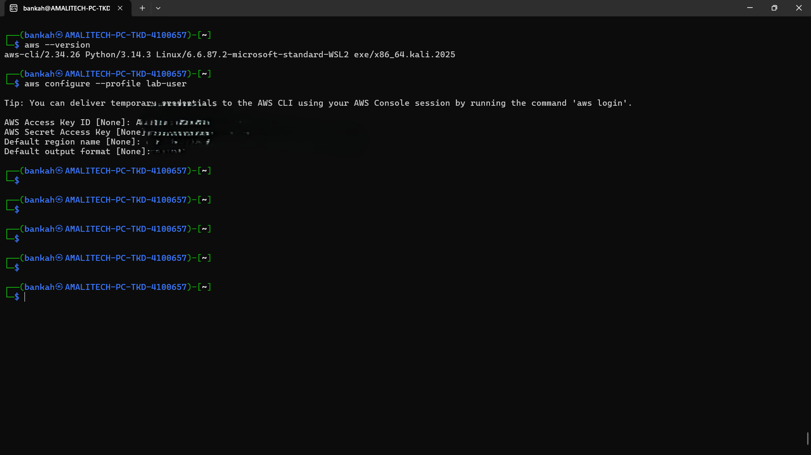
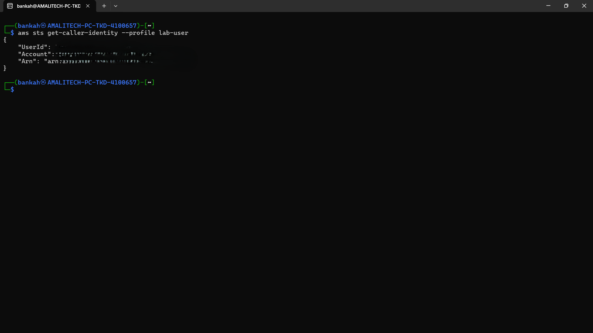
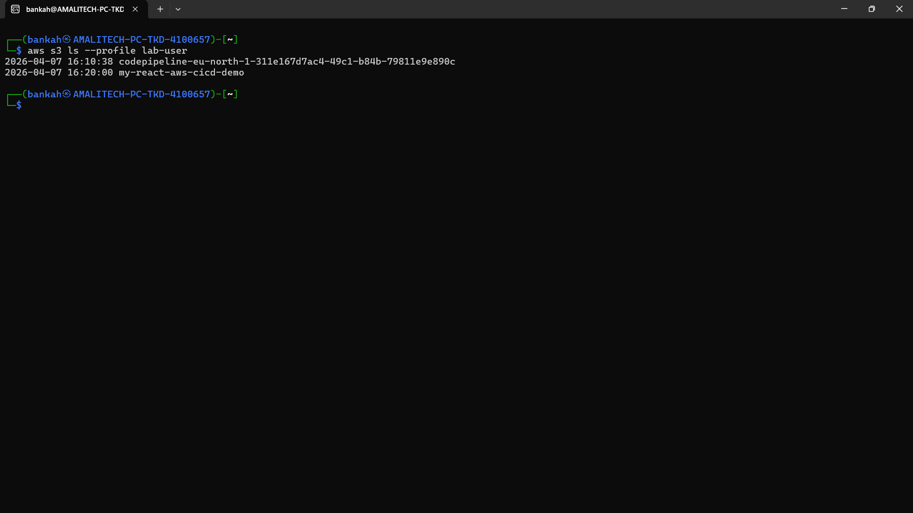
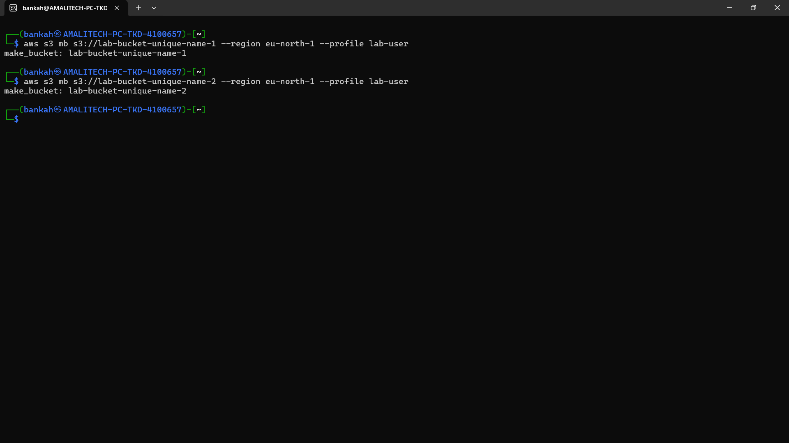
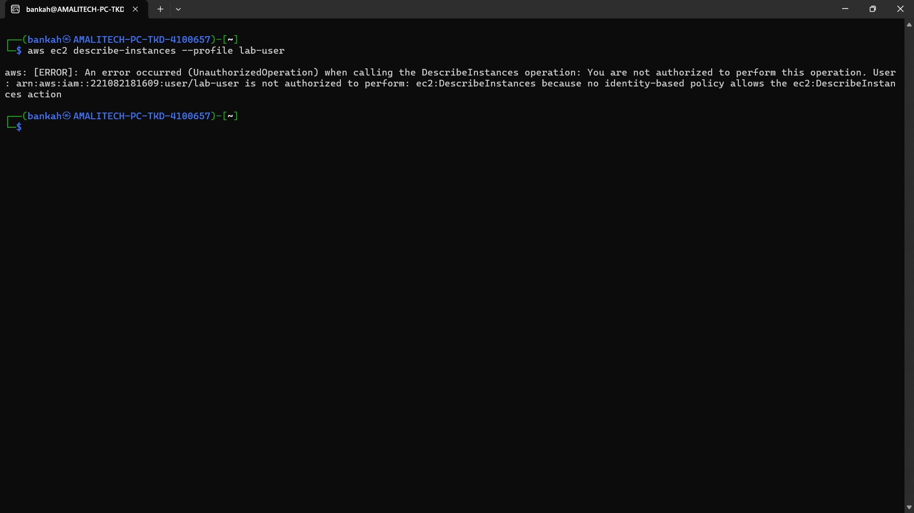

# Lab Report: Testing IAM User Permissions

## Student Name
*Anthony Bekoe Bankah*

## Date
*08/04/2026*

## Lab Title
**Task 2: Using AWS CLI Locally**

---

## Procedure

### Step 1: Configure Profile
Set up a named profile for the IAM user:

#### CLI Command
```bash
aws configure --profile lab-user
```

#### Output


#### Why
Enables CLI to act as that user

---

### Step 2: Verify Identity
Confirm the IAM user identity using STS:

#### CLI Command
```bash
aws sts get-caller-identity --profile lab-user
```

#### Output


#### Why
“Who am I authenticated as?”

---

### Step 3: List S3 Buckets
Check access by listing available S3 buckets:

#### CLI Command
```bash
aws s3 ls --profile lab-user
```

#### Output


#### Why
Tests if S3 permission works

---

### Step 4: Create Two S3 Buckets
Create two unique S3 buckets in the specified region:

#### CLI Command
```bash
aws s3 mb s3://lab-bucket-unique-name-1 --region us-east-1 --profile lab-user
aws s3 mb s3://lab-bucket-unique-name-2 --region us-east-1 --profile lab-user
```

#### Output


#### Why
Verifies write permission

---

### Step 5: List EC2 Instances
Attempt to list EC2 instances:

#### CLI Command
```bash
aws ec2 describe-instances --profile lab-user
```

#### Output


#### Why
This proves IAM is working correctly

---