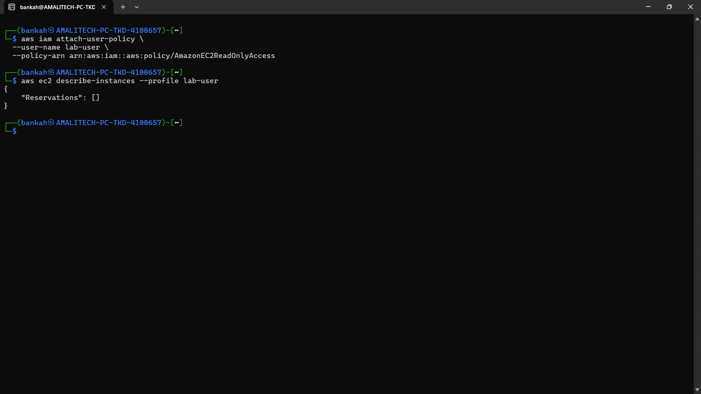

# Lab Report: Testing IAM User Permissions

## Student Name
*Anthony Bekoe Bankah*

## Date
*08/04/2026*

## Lab Title
**Task 3: Challenge (Add EC2 Read Access)**

---

## Objective
The objective of this lab is to:
- Assign read-only permission using AWS managed policy

---

## Procedure

### Step 1: Add EC2 Read Permission
An AWS managed policy is attached to grant read-only EC2 permissions.

#### CLI Command
```bash
aws iam attach-user-policy \
  --user-name lab-user \
  --policy-arn arn:aws:iam::aws:policy/AmazonEC2ReadOnlyAccess
```

#### Output
```bash
  No output
```

#### Why
AWS prefers: Managed policies (easy, reusable)
Instead of: Inline policies (harder to manage)

### Step 2: Test Again
Attempt to list EC2 instances:

#### CLI Command
```bash
aws ec2 describe-instances --profile lab-user
```

#### Output


#### Why
This proves IAM is working correctly